# Reversing the MTI Player for Fun (and no profit!)

## Introduction

MTI (Musical Theatre International) Player is MTI's in-house software for playing production tracks for their licensed musicals. It's MacOS-only, it's a bit of a black box, and it's the only way to play production tracks (eg. non-watermarked tracks) for shows. For "security reasons" you have to also grant it permissions to record your screen, access your full disk, and it forces you to close out of specific other applications (the terminal, Finder, Safari, etc.) before it will play anything. Normally, I don't try to bypass security features like this, but when some software is *this* restrictive, I can't help but be curious as to what's going on under the hood - Also, I don't have a Mac, and I don't want to give Apple more money.


This phenomena in my brain reminds me a bit of the [Streisand Effect](https://en.wikipedia.org/wiki/Streisand_effect), which dictates that the more you try to hide something, the more people will end up finding out about it. For me at least, the more you try to restrict me from doing something with annoying "security" features and what seems to be borderline spyware, the more time I'll spend reversing it. But without further ado, let's start poking around.

## Preliminary Analysis

MTI also has a web app version of the player that can only play rehearsal tracks, which provides a great base to poke around, find their API endpoints, and see what information can be gleamed. The web app is just React, so it's really easy to see what's going on. The lackluster security of the web app is a good sign that the MacOS app is probably not much better, and the developers were kind enough to provide source maps and unminified code (with comments!), which was an amazing help. The source tree is available in `./player` if you're interested in poking around yourself, but you'll need a valid show rehearsal code. Anyway, here's the gist of it:

- The web app uses GraphQL at `https://api.mtishows.com/graphql` to fetch show data and track URLs
  - The GraphQL endpoint is protected by a bearer token that is stored in the web app's source, but it's not clear how it's generated. It doesn't seem to change between devices or sessions, so it's probably not tied to the user and instead tied to the app build itself. Those values, as of the time of writing, are:
  - `X-Client-Id: 1b882a3e-747b-4f00-87f9-2b455735203e`
  - `X-Platform-Id: 72095991-8343-4c89-9f95-eee6f5340224`

Looking in `./player/js/data-graphql/*.js`, we can see a whole bunch of different files with various queries for the GraphQL API. The most interesting one is `./player/js/data-graphql/bookings.js`, which has a query for fetching track URLs:

```gql
query getBookingForCode($rehearsalCode: String!) {
  getBookingForCode(rehearsalCode: $rehearsalCode) {
    rehearsal_tracks {
      cue_number
      track_name
      time
      time_formatted
      location
      track_id
      __typename
    }
    show {
      name
      __typename
    }
    organization {
      name
      __typename
    }
    __typename
  }
}
```

You can see a POC for this that allows you to easily download rehearsal tracks in `./poc_rehearsal.py`. But can we...

```gql
query getBookingForCode($rehearsalCode: String!) {
  getBookingForCode(rehearsalCode: $rehearsalCode) {
    production_tracks { # <--
      cue_number
      track_name
      time
      time_formatted
      location
      track_id
      __typename
    }
    __typename
  }
}
```

No, we definitely can't.

```json
{
  "errors": [
    {
      "message": "Invalid auth token",
      "locations": [
        {
          "line": 3,
          "column": 5
        }
      ],
      "path": [
        "getBookingForCode",
        "production_tracks"
      ],
      "extensions": {
        "code": "INTERNAL_SERVER_ERROR"
      }
    }
  ],
  "data": {
    "getBookingForCode": {
      "production_tracks": null,
      "__typename": "Booking"
    },
    "success": false,
    "message": "Invalid auth token"
  }
}
```

## The Plan

Notably, the graphql query *didn't error*, which means that `production_tracks` is a valid field, but we're just not authorized to access it. This is a good sign that the MacOS app is probably just a thin wrapper around the web app, and that the API is at the very least probably the same. So, the plan is to:

1. Reverse the MacOS app to see how it interacts with the API
2. Figure out the login flow and how the token is generated
3. Reimplement it in a way that allows us to fetch production tracks without a Mac
4. ~~Profit!~~ Avoid profiting since that's illegal
5. Share the knowledge with the world! (That's... uh, legal? Probably.)

Alright, let's get to the fun stuff.

## The MacOS App

> [!NOTE]
> The SHA256 of the ZIP archive containing the app used throughout this writeup is `65804943dc095b7615db26fbe9fa2065e4c23fb48eb54056e99c257408db4ade`. It is also attached in this folder.

The MacOS is compiled natively to MACH-O from Swift (ugh...) and a bit of Objective-C here and there. It's a bit of a mess in IDA, but it's not *too* hard to figure out the basics. Thankfully, there are still some debug symbols present that IDA can load, so we end up with a function list looking something like this:

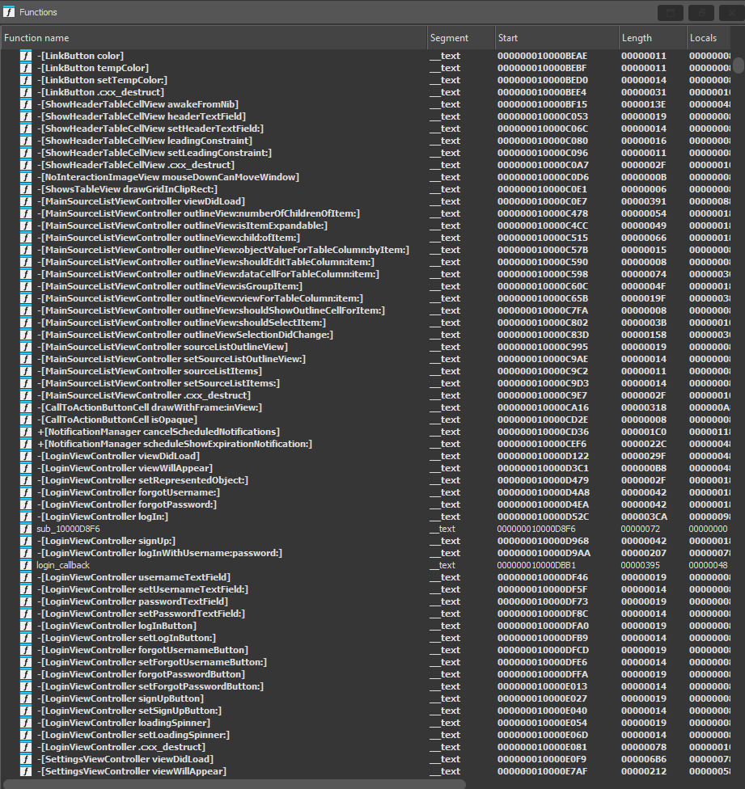

There are lots of junk functions that can be ignored, but the main one we're interested in (at least for recovering tokens from the auth flow) is `-[LoginViewController logInWithUsername:password:]` (at `0x000000010000D9AA`). Here's IDA's pseudocode:

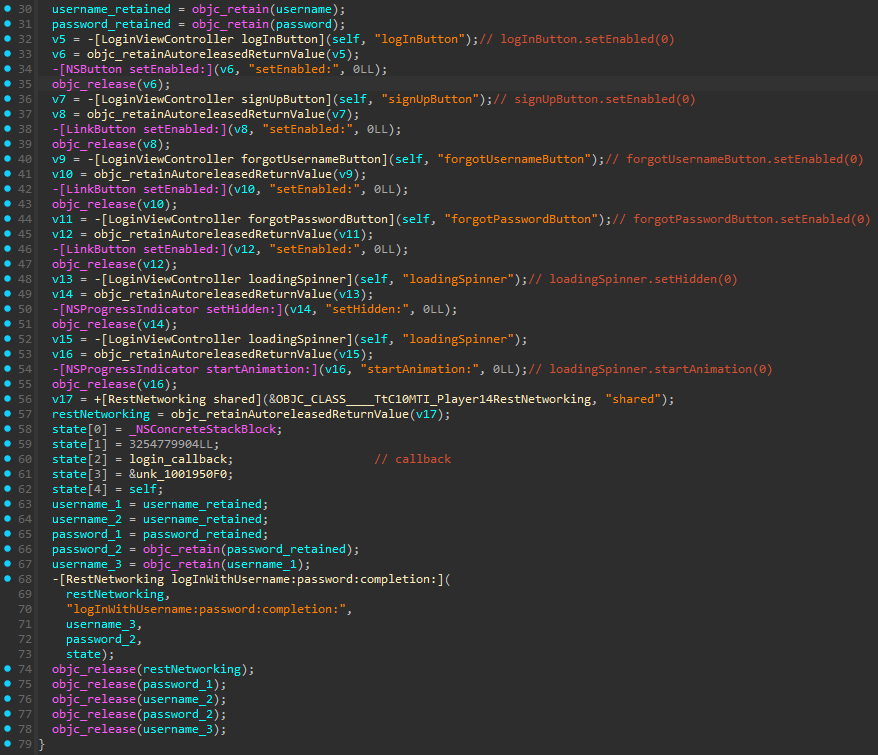

As you can see, it's a relatively simple callback-based login flow - all the buttons are disabled, a loading spinner gets shown, and the request is dispatched, and then the response is handled. Diving deeper, we see a call to `-[RestNetworking logInWithUsername:password:completion:]`, which is the very start of the actual networking code. It's really just a glorified wrapper in the end, and going deeper brings us to `sub_100028BD0` (renamed to `make_network_call_to_login` in the provided IDB), which creates a dictionary with the username and password, then calls to make the actual HTTP request. The pseudocode is very hard to read, but after some cleaning up we get something along the lines of:

```json
{
  "username": "username",
  "password": "password"
}
```

The actual network request is a bit of a pain:

```c
make_http_request(1414745936LL, 0xE400000000000000LL, 'ningis/', 0xE700000000000000LL, _dict);// /signin
```

The first thing you'll likely notice is how `/signin` is reversed as `ningis/`. Presumably, the request is a POST request with a JSON body, but we can't entirely be sure of that yet. Digging deeper, we can find this method:

```c
id __fastcall setup_restNetworking()
{
  void *self; // r13 removed struct type since it made it harder to read
  objc_class *ObjectType; // r14
  __int64 platformId; // rax
  __int64 clientId; // rax
  __int64 productionHost; // rax
  __int64 stagingHost; // rax
  char *urlComponents; // rbx
  __int64 components_meta; // rax
  objc_super super; // [rsp+0h] [rbp-20h] BYREF

  ObjectType = swift_getObjectType(self);
  platformId = OBJC_IVAR____TtC10MTI_Player14RestNetworking_platformId;
  *(self + OBJC_IVAR____TtC10MTI_Player14RestNetworking_platformId) = 0xD000000000000024LL;
  *(self + platformId + 8) = "DownloadTrackProgressChange" + 0x8000000000000000LL;
  clientId = OBJC_IVAR____TtC10MTI_Player14RestNetworking_clientId;
  *(self + OBJC_IVAR____TtC10MTI_Player14RestNetworking_clientId) = 0xD000000000000024LL;
  *(self + clientId + 8) = "13-9820-3727d263e140" + 0x8000000000000000LL;
  productionHost = OBJC_IVAR____TtC10MTI_Player14RestNetworking_productionHost;
  *(self + OBJC_IVAR____TtC10MTI_Player14RestNetworking_productionHost) = 0xD000000000000010LL;
  *(self + productionHost + 8) = "00-87f9-2b455735203e" + 0x8000000000000000LL;
  stagingHost = OBJC_IVAR____TtC10MTI_Player14RestNetworking_stagingHost;
  *(self + OBJC_IVAR____TtC10MTI_Player14RestNetworking_stagingHost) = 0xD000000000000018LL;
  *(self + stagingHost + 8) = "api.mtishows.com" + 0x8000000000000000LL;
  urlComponents = self + OBJC_IVAR____TtC10MTI_Player14RestNetworking____lazy_storage___urlComponents;
  components_meta = type metadata accessor for URLComponents(0LL);
  (*(*(components_meta - 8) + 56LL))(urlComponents, 1LL, 1LL, components_meta);// presumably a constructor
  *(self + OBJC_IVAR____TtC10MTI_Player14RestNetworking____lazy_storage___headers) = 0LL;
  *(self + OBJC_IVAR____TtC10MTI_Player14RestNetworking____lazy_storage___downloadsSession) = 0LL;
  super.receiver = self;
  super.super_class = ObjectType;
  return objc_msgSendSuper2(&super, "init");
}
```

This is responsible for setting up the MTI_Player14RestNetworking class with the header values, which are:

- `x-platform-id`: Set to "DownloadTrackProgressChange"
- `x-client-id`: Set to "13-9820-3727d263e140"
- `x-app-version`: Pulled from the main bundle's info dictionary
- `x-device-id`: Generated at runtime via `sub_10002B740()`
- `x-device-type`: Set to "Mac"
- `x-device-desc`: Set to the machine's hostname (via `NSHost.currentHost().localizedName`)

This seems all well and good, but when we put it into Postman to test...

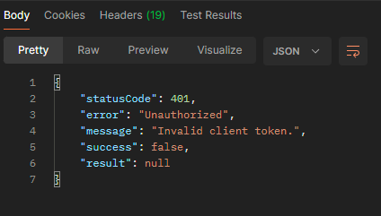

Damn! So close. Again, looking at the client ID and platform ID from earlier, we can see that they're UUIDs - following the standard format of 8-4-4-4-12 hexadecimal digits separated by hyphens. Going back to the pseudocode, a few things jump out:

```c
  *(self + clientId + 8) = "13-9820-3727d263e140" + 0x8000000000000000LL;
  productionHost = OBJC_IVAR____TtC10MTI_Player14RestNetworking_productionHost;
  *(self + OBJC_IVAR____TtC10MTI_Player14RestNetworking_productionHost) = 0xD000000000000010LL;
  *(self + productionHost + 8) = "00-87f9-2b455735203e" + 0x8000000000000000LL;
  stagingHost = OBJC_IVAR____TtC10MTI_Player14RestNetworking_stagingHost;
  *(self + OBJC_IVAR____TtC10MTI_Player14RestNetworking_stagingHost) = 0xD000000000000018LL;
```

You can see there are two halves of what look to be UUIDs - presumably the ends. Cut past an hour of bashing my head against a wall with the pseudocode and I decided to open up IDA's strings view and search for the ends of the UUIDs. Lo and behold, there they were:


There are only two possible configurations - one's the client ID and the other is the platform ID. Sticking them in order (client, platform) into Postman, we get...

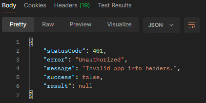

Yes! This is a slightly different error message, which means we're definitely getting closer. The error message is now `Invalid app info headers` which means we're at least getting the auth right. Presumably, the app info headers are `x-app-version`, `x-device-id`, `x-device-type`, and `x-device-desc`. The `x-app-version` is easy to get - looking at `Info.plist` from the app archive, we can see:

```xml
<key>CFBundleInfoDictionaryVersion</key>
<string>6.0</string>
<!-- ... -->
<key>CFBundleShortVersionString</key>
<string>1.2.1</string>
<!-- ... -->
<key>CFBundleVersion</key>
<string>35</string>
```

I'm not a MacOS developer, so it took me an embarrassingly long time to realize that it's `CFBundleShortVersionString` that was the needed information rather than `CFBundleInfoDictionaryVersion`. `x-device-type` is just `Mac`, and `x-device-desc` is the hostname, which can be anything for our reimplementation. `x-device-id` is generated with this function:

```c
__int64 sub_10002B740()
{
  CFMutableDictionaryRef v0; // rax
  const __CFDictionary *v1; // r14
  io_service_t MatchingService; // r15d
  __CFString *v3; // rsi
  CFTypeRef CFProperty; // rbx
  __int64 v6; // [rsp+8h] [rbp-38h] BYREF
  CFTypeRef v7[5]; // [rsp+18h] [rbp-28h] BYREF

  v0 = IOServiceMatching("IOPlatformExpertDevice");
  v1 = objc_retain(v0);
  MatchingService = IOServiceGetMatchingService(kIOMasterPortDefault, v1);
  v3 = String._bridgeToObjectiveC()();
  CFProperty = IORegistryEntryCreateCFProperty(MatchingService, v3, kCFAllocatorDefault, 0);
  objc_release(v3);
  IOObjectRelease(MatchingService);
  if ( !CFProperty )
    BUG();
  swift_unknownObjectRetain(CFProperty);
  objc_release(v1);
  v7[0] = CFProperty;
  swift_dynamicCast(&v6, v7, &type metadata for Swift.AnyObject + 8, &type metadata for String, 7LL);
  return v6;
}
```

Although this is a reasonably long function, it's basically doing the Swift/Obj-C equivalent of:

```bash
ioreg -l | grep IOPlatformSerialNumber
```

Since I don't have a Mac to steal the serial number of, I'll instead graciously borrow one from Recorded Future's [tria.ge](https://tria.ge/dashboard) - thanks! On the MacOS sandbox I got randomly assigned, the serial number was `W80CD98B5PF`.

Putting it all together, we get:

```txt
x-platform-id:bd6dbdd5-778d-4013-9820-3727d263e140
x-client-id:1b882a3e-747b-4f00-87f9-2b455735203e
x-device-type:Mac
x-app-version:1.2.1
x-device-desc:test-mac-hostname
x-device-id:W80AA98A5PE
```

Incredibly, this works to authenticate! Now, back to that query we made earlier...

```gql
query getBookingForCode($rehearsalCode: String!) {
  getBookingForCode(rehearsalCode: $rehearsalCode) {
    production_tracks {
      cue_number
      track_name
      time
      time_formatted
      location
      track_id
      __typename
    }
    __typename
  }
}
```

Let's see if it works...

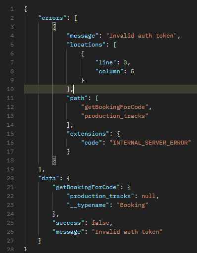

And still nothing! This is the point where I assume further authentication is needed - since before, it was only based on the rehearsal code. Let's try making a call to `/signin` with the same body as before, but with a real account:

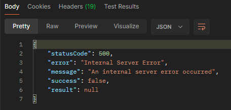

Fascinatingly, this returns a `500 Internal Server Error`, which is absolutely not what I was expecting. Let's go back to the MacOS app and see if we can find anything else.

## Authentication Flow

**Signing up:**

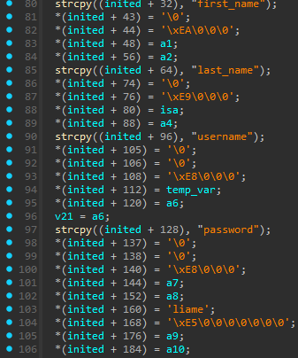


An account can be created by sending a `POST` to `https://api.mtishows.com/signup` with a JSON body of:

```json
{
  "first_name": "First",
  "last_name": "Last",
  "username": "username",
  "password": "password",
  "email": "email@email.com"
}
```

For some reason, it will at first return a `500 Internal Server Error`:

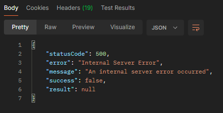

But if you retry the request...

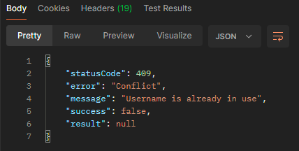

It seems to create the account just fine! The `500` is likely a bug in the API, but it's not a big deal for this purpose... yet. You can test that your account was created successfully by logging into the [web portal](https://player.mtishows.com/production) and looking for this error message:

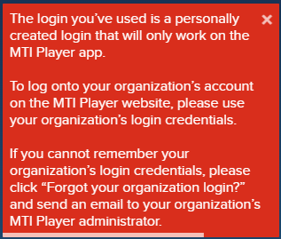

**Logging in:**

At a cursory glance, the login flow seems to be just sending a `POST` request to `https://api.mtishows.com/signin` with a JSON body of:

```json
{
  "username": "username",
  "password": "password"
}
```

But, something doesn't quite work - it throws an internal server error whenever correct credentials are provided. This bug is the main stopping point for this writeup. So, I decided to suffer for science and try to set up a MITM proxy inside of an ephemeral VM on `tria.ge`. I used [Proxyman](https://proxyman.io/) to intercept the requests, and here's the methodology if you want to try it yourself:

1. Set up a VM on `tria.ge` with a MacOS image
2. Install Proxyman on the VM
3. Install MTI Player on the VM
4. Grant Proxyman the rights to intercept traffic (password is `root`)
5. Open MTI Player and try to log in with incorrect credentials
6. Check the Proxyman logs and double-click `/signin` to see the request body
7. Grant Proxyman permission to decrypt HTTPS traffic for MTI Player
8. Close and re-open MTI Player
9. Log in with incorrect credentials, then correct credentials (to capture both)
10. Save the request session to your Downloads
11. Open a terminal: `cd Downloads`, `curl bashupload.com -T <session name>.proxymansession`
12. Download the session file from your host

The session file is basically a compressed JSON file, which you can read using the attached `read_proxyman_session.py` script, eg:

```txt
python read_proxyman_session.py <session name>.proxymansession
```

Then, see `session.json` in the same directory.

## Fixing Login

Looking at the headers for a request in the captured session, we see:

```txt
Host:api.mtishows.com
x-device-desc:test%E2%80%99s%20iMac
Accept:application/json
Accept-Encoding:gzip, deflate, br
Accept-Language:en-us
Content-Type:application/json
x-platform-id:bd6dbdd5-778d-4013-9820-3727d263e140
Content-Length:37
x-client-id:1b882a3e-747b-4f00-87f9-2b455735203e
x-device-id:79C87F0E-9237-5ABD-AA91-25F794E1F52E
x-app-version:1.2.1
User-Agent:MTI%20Player/35 CFNetwork/1120 Darwin/19.0.0 (x86_64)
Connection:keep-alive
x-device-type:Mac
```

Notice that `x-device-id` is not a serial number of the format that we were using before, but instead a UUID. When adding this to the request, we get:


The body of the request is something other than an internal server error! This is a great start - let's look at the next request in the session, to `/graphql`:

```txt
Host:api.mtishows.com
X-APOLLO-OPERATION-NAME:GetShows
x-device-id:79C87F0E-9237-5ABD-AA91-25F794E1F52E
apollographql-client-version:1.2.1-35
x-device-type:Mac
Accept:*/*
User-Agent:MTI%20Player/35 CFNetwork/1120 Darwin/19.0.0 (x86_64)
Connection:keep-alive
Accept-Language:en-us
Accept-Encoding:gzip, deflate, br
Content-Type:application/json
x-platform-id:bd6dbdd5-778d-4013-9820-3727d263e140
Content-Length:1012
x-client-id:1b882a3e-747b-4f00-87f9-2b455735203e
x-auth-token:<censored, the same token as above>
apollographql-client-name:com.mtishows.mtimac-apollo-ios
x-app-version:1.2.1
X-APOLLO-OPERATION-TYPE:query
x-device-desc:test%E2%80%99s%20iMac
```

Let's try adding the auth token to the GraphQL query we made earlier, and see what happens:

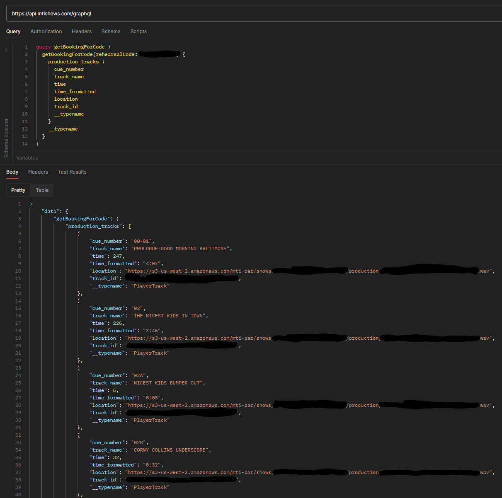

That's it! We've successfully authenticated and fetched production tracks' URLs. You can see a complete POC in `./poc_production.py`.

## Conclusion

This was a fun little project to work on, and I hope you enjoyed reading it as much as I enjoyed writing it. I'm not sure if I'll continue to work on this project, but I hope that this writeup can help others who are stuck with this abysmal software. As always, my IDB is attached. If you have any questions, feel free to reach out to me on Discord `@n3rdl0rd`.

:heart: N3rdL0rd